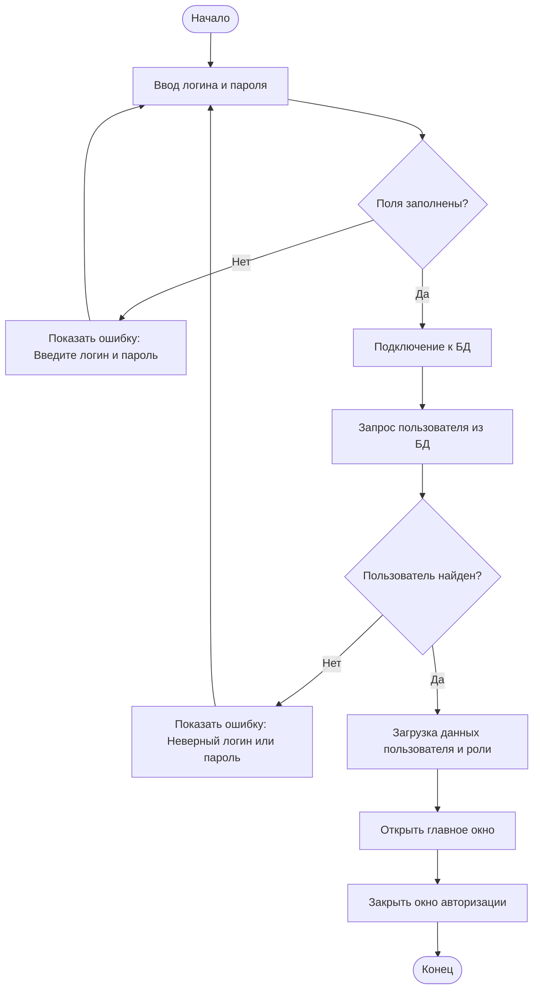
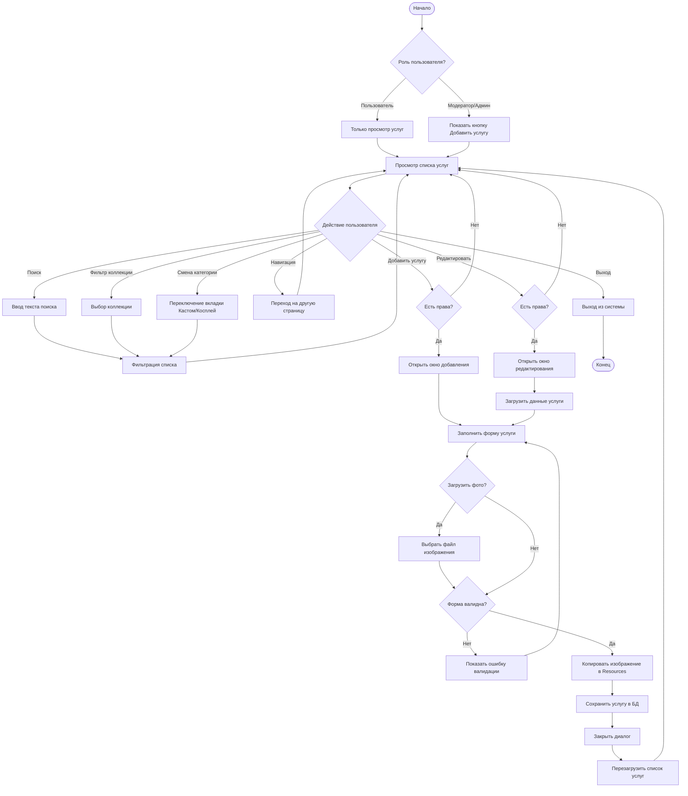
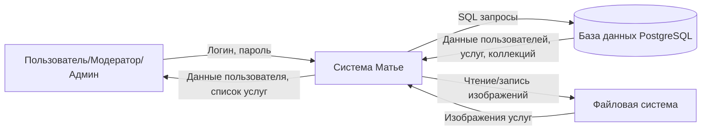
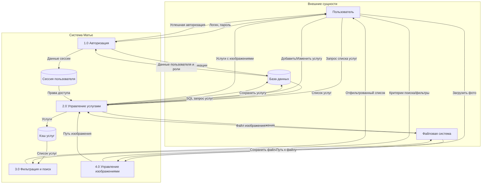
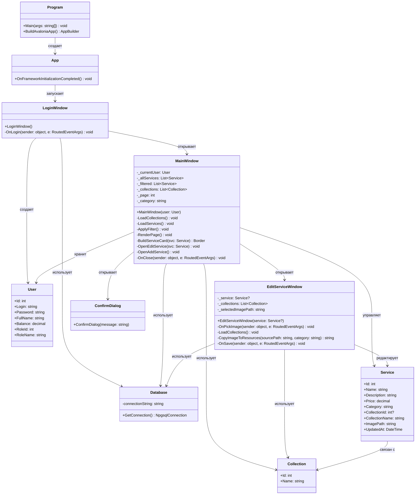

# Диаграммы системы Матье

## 1. Use Case диаграмма (Диаграмма вариантов использования)

```mermaid
graph TB
    subgraph "Система Матье"
        UC1[Авторизация в системе]
        UC2[Просмотр услуг]
        UC3[Поиск услуг]
        UC4[Фильтрация по коллекции]
        UC5[Добавление услуги]
        UC6[Редактирование услуги]
        UC7[Загрузка фото услуги]
        UC8[Переключение категорий]
        UC9[Навигация по страницам]
        UC10[Выход из системы]
    end
    
    Guest[Гость]
    User[Пользователь]
    Moderator[Модератор]
    Admin[Администратор]
    
    Guest --> UC1
    
    User --> UC2
    User --> UC3
    User --> UC4
    User --> UC8
    User --> UC9
    User --> UC10
    
    Moderator --> UC2
    Moderator --> UC3
    Moderator --> UC4
    Moderator --> UC5
    Moderator --> UC6
    Moderator --> UC7
    Moderator --> UC8
    Moderator --> UC9
    Moderator --> UC10
    
    Admin --> UC2
    Admin --> UC3
    Admin --> UC4
    Admin --> UC5
    Admin --> UC6
    Admin --> UC7
    Admin --> UC8
    Admin --> UC9
    Admin --> UC10
```

## 2. Activity диаграмма (Диаграмма активности)

### 2.1 Процесс авторизации

### 2.2 Процесс управления услугами

## 3. DFD диаграмма (Диаграмма потоков данных)

### Уровень 0 (Контекстная диаграмма)

### Уровень 1 (Детализация процессов)

## 4. Диаграмма классов

## Описание диаграмм

### Use Case диаграмма
Показывает взаимодействие различных ролей пользователей (Гость, Пользователь, Модератор, Администратор) с функциями системы. Модераторы и администраторы имеют расширенные права на управление услугами.

### Activity диаграммы
1. **Процесс авторизации**: Детально описывает шаги входа в систему с валидацией данных
2. **Процесс управления услугами**: Показывает полный цикл работы с услугами, включая просмотр, поиск, фильтрацию, добавление и редактирование

### DFD диаграммы
1. **Уровень 0**: Контекстная диаграмма показывает систему как единое целое с внешними сущностями
2. **Уровень 1**: Детализирует основные процессы системы и потоки данных между ними

### Диаграмма классов
Показывает структуру классов приложения, их атрибуты, методы и взаимосвязи. Включает модели данных (User, Service, Collection), окна (LoginWindow, MainWindow, EditServiceWindow) и вспомогательные классы (Database, Program, App).

